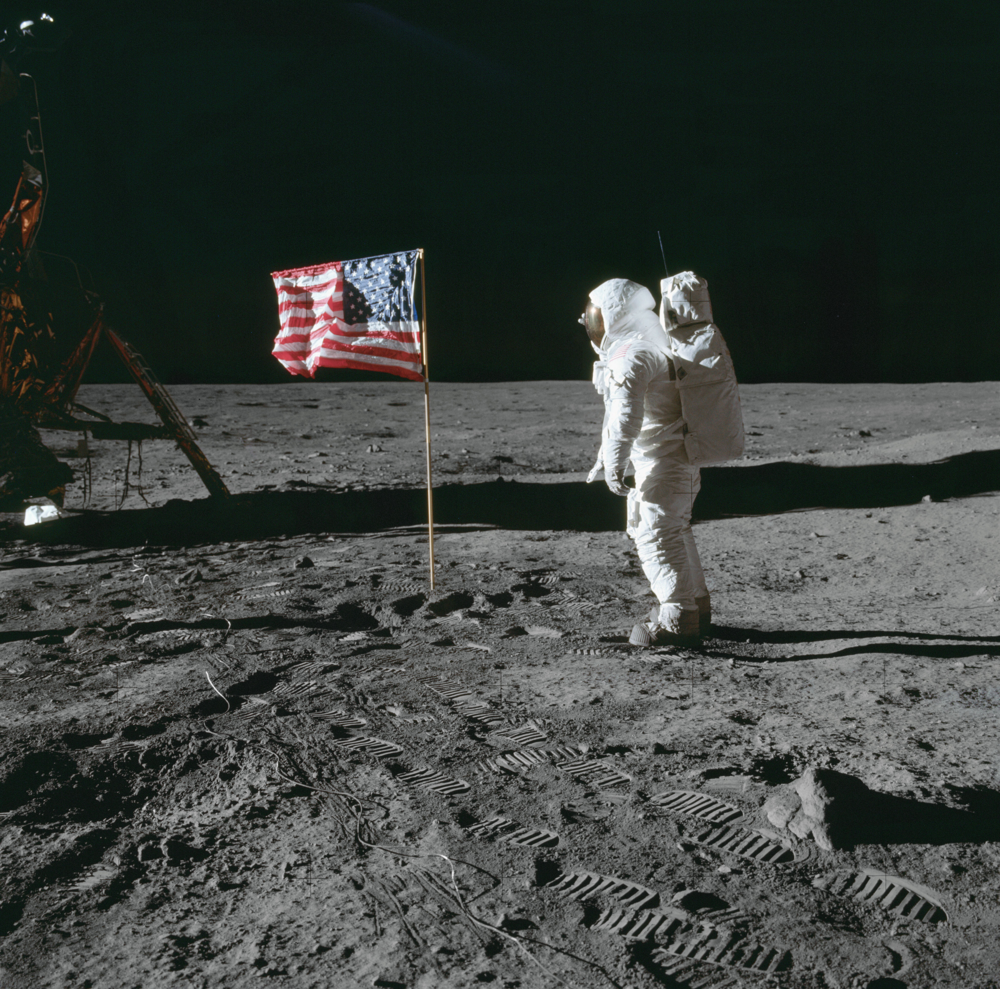
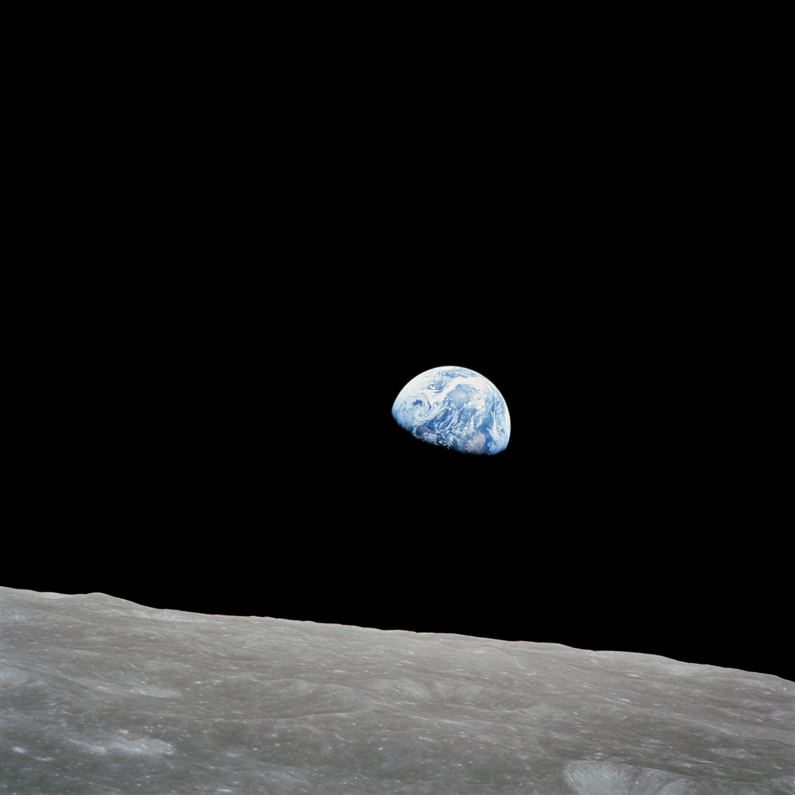
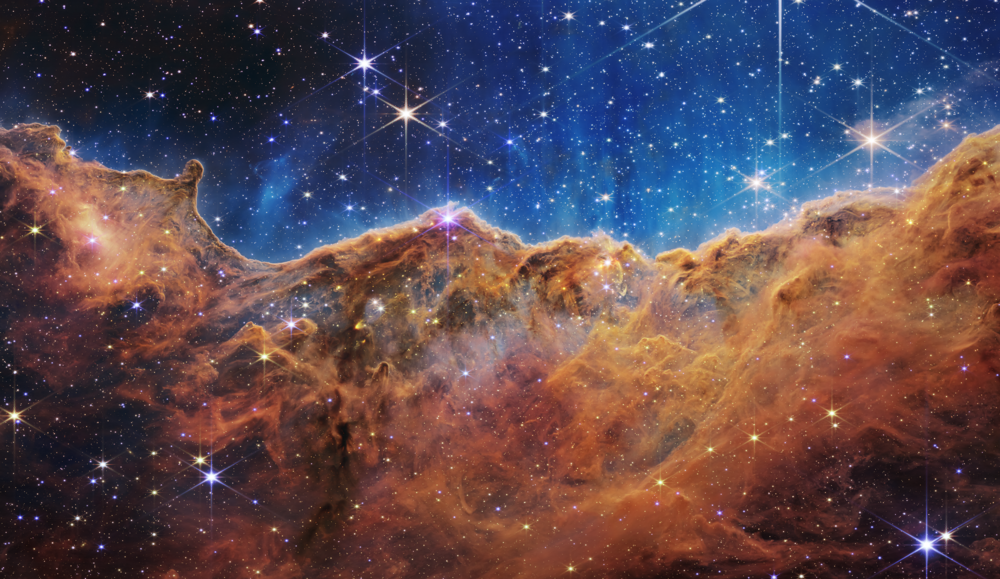

# Apollo 11 Mission Summary

## Overview

- Launched 16 July 1969 from Kennedy Space Center LC-39A
- Crew: Neil Armstrong, Michael Collins, Edwin "Buzz" Aldrin
- First crewed lunar landing: 20 July 1969, Mare Tranquillitatis
- Total mission duration: 8 days, 3 hours, 18 minutes

## The Crew on the Surface

## The View Home

## Legacy Observations

- Approximately 21.5 kg of lunar material returned
- Surface EVA duration: 2 hours 31 minutes
- The Eagle's ascent stage was jettisoned into lunar orbit
- Quarantine protocols retired after Apollo 14

## Looking Further Out

## Summary

The Apollo program demonstrated staged lunar rendezvous, precision
navigation, and surface operations that remain foundational to
current exploration programs. This document is generated from
public-domain NASA material for use as a realistic presentation
file in a compression benchmark corpus.
